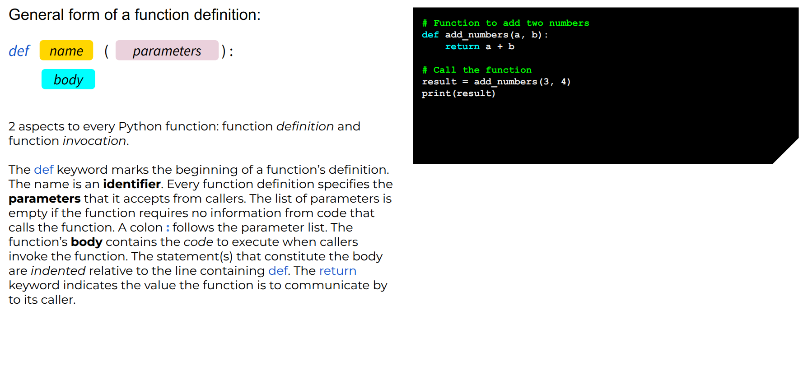
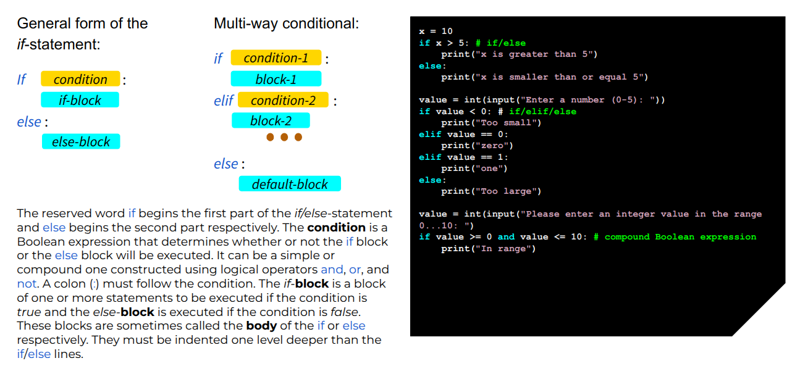

---
jupyter:
  jupytext:
    text_representation:
      extension: .md
      format_name: markdown
      format_version: '1.3'
      jupytext_version: 1.16.6
  kernelspec:
    display_name: Python 3 (ipykernel)
    language: python
    name: python3
---

<!-- #region slideshow={"slide_type": "slide"} -->
ARC course "Learning to programme with Python" (beginner level)
===============================================================

<!-- #endregion -->

<!-- #region slideshow={"slide_type": ""} -->
Welcome to our ARC course "Learning to programme with Python".

Some general information on how the course will run:

* The course will run from 09:00 to 12:30. We plan a coffee break between 2 parts at around 10:45 for ~10-15 min.

* The material does not expect any prior programming experience.

* Each topic will be presented wih code demonstrations followed by practical exercises.

* We are happy to answer any questions during the course and to help during the exercises.

Enjoy learning Python!
<!-- #endregion -->

<!-- #region slideshow={"slide_type": "slide"} -->
## Set up your Python environment
<!-- #endregion -->

<!-- #region slideshow={"slide_type": ""} -->
<ins>Preferred</ins>: Jupyter Notebook server or Jupyter Lab as a local Python environment installed on your laptops (hopefully, you've already received a welcome email with installation instructions).

<ins>Other</ins>: Google Colab (https://colab.research.google.com).

Go to the repository:
```https://github.com/DurhamARC-Training/BasicProgrammingPython```

copy the `pull_files_from_repo.py` file into your environment

execute it with `python pull_files_from_repo.py`
<!-- #endregion -->

<!-- #region slideshow={"slide_type": "skip"} -->
# <ins>Table of Contents</ins>
<!-- #endregion -->

<!-- #region slideshow={"slide_type": "slide"} -->
# <ins>0.</ins> Introduction
<!-- #endregion -->

<!-- #region slideshow={"slide_type": "slide"} -->
## Course objectives
<!-- #endregion -->

<!-- #region slideshow={"slide_type": ""} -->
By the end of this course you should know:
 - how a basic computer program is written and executed,
 - what basic data types and control statements are,
 - how to get and process user input and data,
 - how to structure your code using functions,
 - what can lead to your program not working, and what to do about it,
 - where to find further resources to practice your Python programming.
<!-- #endregion -->

<!-- #region slideshow={"slide_type": "skip"} -->
##### _<ins>Notes:</ins>_
<!-- #endregion -->

<!-- #region slideshow={"slide_type": "notes"} -->
 - We'll talk about how to get a simple computer program running, the basics in terms of *data types*, *variables*, *if-statements* and *loops*, getting data in and out of the program, *functions* and *variable scope*, and a bit about *comments*, *error types* and their *handling*.
 - I hope that this course will give you a good foundation to continue your Python learning further. Programming is a lot about learning by doing. There are tons of online (and offline) resources as well as forums (online and offline) where you can ask for help.
<!-- #endregion -->

<!-- #region slideshow={"slide_type": "slide"} -->
## Useful resources
<!-- #endregion -->

<!-- #region slideshow={"slide_type": ""} -->
#### Materials used and recommended:
 - [Python Wiki - Python for Non-Programmers](https://wiki.python.org/moin/BeginnersGuide/NonProgrammers)
 - [How to think like a Computer Scientist](http://openbookproject.net/thinkcs/python/english3e/index.html)
 - [A Whirlwind Tour of Python](https://jakevdp.github.io/WhirlwindTourOfPython)
 - [Software Carpentry - Programming with Python](https://swcarpentry.github.io/python-novice-inflammation/index.html)
<!-- #endregion -->

<!-- #region slideshow={"slide_type": "notes"} -->
##### _<ins>Notes:</ins>_
<!-- #endregion -->

<!-- #region slideshow={"slide_type": "notes"} -->
Here is a list of sources that were used when this course was prepared. It is great for self-study, and you can use it after this course to continue on your own.

 - *Python Wiki*, as a website, is a good resource of Python knowledge. The link I give you here is to the site "Python for Non-Programmers", that has an extensive list of materials to learn Python if you have not programmed in any language before.
 - *How to think like a Computer Scientist*. Some of the structure and ideas of the first few chapters have been used for this course.
 - *A Whirlwind Tour of Python* has a faster pace, and seems to be targeted at a more technically-minded audience.
 - *Software Carpentry* is an organisation aimed at providing basic software training for everyone. They have a "<ins>train the trainers</ins>" approach, which means that they provide material and training courses for software carpentry trainers. Thankfully, you are also allowed to access and use their material for free. This training course here gives a Python introduction at hands of a practical data processing task.
<!-- #endregion -->

<!-- #region slideshow={"slide_type": "fragment"} -->
 - The top results are often filled with SEO sites
 - The aim is not to provide a concise explanation, but to show you as many ads as possible
 - Very verbose, lots of unneccesary alternatives.

 Example: "python how do I invert a list"

 Recommend: w3schools, python.org (which is often more technical)
<!-- #endregion -->

<!-- #region slideshow={"slide_type": "notes"} -->
_**Notes**_: Do not show search results. Just keep as small topic.
<!-- #endregion -->

<!-- #region slideshow={"slide_type": "slide"} -->
## Programming crash course
<!-- #endregion -->

<!-- #region slideshow={"slide_type": "slide"} -->
### Programming means: make the computer do the work for you!
<!-- #endregion -->

<!-- #region slideshow={"slide_type": ""} -->
 - Do the maths
 - Boring repetitions
 - Too complicated/extensive tasks
 - Big data sets 
 - Make your analysis reproducible
 -  ...
<!-- #endregion -->

<!-- #region slideshow={"slide_type": "slide"} -->
### Running code in a compiled language (such as C)
<!-- #endregion -->

1. Write your code in a high-level programming language.
2. Translate into low-level (machine/assembly) language.
3. Execute the program.

<!-- #region slideshow={"slide_type": "notes"} -->
##### _<ins>Notes:</ins>_
<!-- #endregion -->

<!-- #region slideshow={"slide_type": "notes"} -->
Now, how do we get the computer to do these things for us? This is what we are doing: We write the program in a language that we as human beings (with some training) can understand. As the computer won't be able to understand the code that way, we then compile it, which means that we translate it into computer language. Then we execute the program and, given we have made no mistake, the computer will get working for us.  
<!-- #endregion -->

<!-- #region slideshow={"slide_type": "slide"} -->
### Running code in an interpreted language (such as Python)
<!-- #endregion -->

<!-- #region slideshow={"slide_type": ""} -->
1. Write your code in high-level programming language.
2. Interpret code and execute directly
<!-- #endregion -->

<!-- #region slideshow={"slide_type": "notes"} -->
##### _<ins>Notes:</ins>_
<!-- #endregion -->

<!-- #region slideshow={"slide_type": "notes"} -->
Things can be made a little bit easier by using an interpreted scripting language instead of a compiled programming language.
 - *Beware!*: Oversimplification

Please note that I am oversimplifying here a bit with regards to the terminology. The point I want to make is that there are languages, such as Python, which we will be using in this course, that translate and execute the code directly, without us having to do a separate compilation step.
<!-- #endregion -->

<!-- #region slideshow={"slide_type": "slide"} -->
### Python can be executed in different ways
#### Command line script
<!-- #endregion -->

<!-- #region slideshow={"slide_type": ""} -->
1. Create a `myname.py` file
2. run python `myname.py`
<!-- #endregion -->

<!-- #region slideshow={"slide_type": "fragment"} -->
#### interactive or ipython session:
 - Start with typing `python` or better `ipython`
<!-- #endregion -->

<!-- #region slideshow={"slide_type": "slide"} -->
### Demonstration of using _Jupyter_ notebook
<!-- #endregion -->

<!-- #region slideshow={"slide_type": ""} -->
Jupyter works with cells such as these, which you execute with the play button or `Shift/Strg + Enter`:
<!-- #endregion -->

<!-- #solution -->

```python slideshow={"slide_type": ""}
# Add just a one to the cell and execute
1
```

<!-- #endsolution -->

<!-- #region slideshow={"slide_type": ""} -->
If the box on the left is empty, you have not executed it. Otherwise a number indicates in which order the execution took place.

You can add cells with the plus. You can also change the type
<!-- #endregion -->

<!-- #region slideshow={"slide_type": ""} -->
##### Now it is markdown and the `#` indicates a header (or `##`, etc., up to 6 times, with smaller font sizes)
<!-- #endregion -->

<!-- #region slideshow={"slide_type": "notes"} -->
##### _<ins>Notes:</ins>_
<!-- #endregion -->

<!-- #region slideshow={"slide_type": "notes"} -->
 - We have individual cells to run. To do so press the run button or `Shift + Enter`
 - The small number in the box in front indicates a cell has been run.
<!-- #endregion -->

<!-- #region slideshow={"slide_type": "slide"} -->
# <ins>**Part I**</ins>
<!-- #endregion -->

<!-- #region slideshow={"slide_type": "slide"} -->
# <ins>1.</ins> Basics
<!-- #endregion -->

<!-- #region slideshow={"slide_type": "notes"} -->
In this section we will look into the very basics of programming, to give you the foundations
to start from. A lot of it will be transferrable to other programming languages,
even if the exact syntax, the way how you write things down, changes.
<!-- #endregion -->

<!-- #region slideshow={"slide_type": "slide"} -->
## Basic data types
As any programming language, Python can deal with many different data types. Among the basic ones are `str` strings, `int` integers, `float` floating-point numbers and `bool` booleans.
<!-- #endregion -->

<!-- #region slideshow={"slide_type": ""} -->
- Strings: "Heinz", 'Banana', 'He said "Hello"'
- Integers: 1, 2, 3, 22222222, -777
- Floats: -1.2, 0.0, 2.7182
- Booleans: True, False
<!-- #endregion -->

<!-- #region slideshow={"slide_type": "notes"} -->
##### _<ins>Notes:</ins>_
<!-- #endregion -->

<!-- #region slideshow={"slide_type": "notes"} -->
When you are programming, you have to be clear about what type each item you are handling has. Each data type has different rules. In the most basic version, Python has the following data types:
- Strings, which are bits of text, noted by single or double quotation marks, which can be nested.
- Integers, which are whole numbers, positive or negative.
- Floats, or floating points numbers, which allow for a fractional part.
- Booleans, or bools, which are truth values, and can be either true or false.
<!-- #endregion -->

<!-- #region slideshow={"slide_type": "slide"} -->
## Variables
Values are stored in _variables_, which are of data types listed above or more complex ones.
<!-- #endregion -->

<!-- #region slideshow={"slide_type": ""} -->
- “I reserve a space in memory for my data bit, and I call it 
by the name x
- Syntax: name = value”
<!-- #endregion -->

<!-- #region slideshow={"slide_type": "notes"} -->
##### _<ins>Notes:</ins>_
<!-- #endregion -->

<!-- #region slideshow={"slide_type": "notes"} -->
The next essential concept you need to know for programming in Python are variables.

By writing ``name = value'', you are basically saying "I reserve a space in memory for my data bit, which is value, and I call it name". Then you can use the name to further process your data bit, as we have seen in the example with the print statement.
<!-- #endregion -->

<!-- #region slideshow={"slide_type": "slide"} -->
### _<ins>Example</ins>:_ Print type of a variable
<!-- #endregion -->

<!-- #solution -->

```python slideshow={"slide_type": ""}
# print statement "Hello"
print("Hello")
```

<!-- #endsolution -->

<!-- #solution -->

```python slideshow={"slide_type": ""}
# put the content of the print statement in a variable
my_string = "Hello"
print(my_string)
```

<!-- #endsolution -->

<!-- #solution -->

```python slideshow={"slide_type": ""}
# check the type of that variable
type(my_string)
```

<!-- #endsolution -->

<!-- #region slideshow={"slide_type": "notes"} -->
##### _<ins>Notes:</ins>_
<!-- #endregion -->

<!-- #region slideshow={"slide_type": "notes"} -->
In this example we see the print statement again. It will usually expect a string, or something that can be converted to a string.

Here we are saying that the variable "myString2 should have the string value 'He said "Hello"', and then put the print statement separately. The "type" command is able to tell us, what type the variable ``myString'' has. [demonstrate]

As a side note, many programming languages, in particular compiled programming languages, require you to explicitly state the data type of your variable when you create it. We do not need to do that here.
<!-- #endregion -->

<!-- #region slideshow={"slide_type": "slide"} -->
### _<ins>Example</ins>:_ Try to assign the data types at the following qr code
<!-- #endregion -->

Try not to overthink. If something is ambiguous pick what fits best


<!-- #region slideshow={"slide_type": "notes"} -->
##### _<ins>Notes:</ins>_
<!-- #endregion -->

<!-- #region slideshow={"slide_type": "notes"} -->
Questions behind QR Code
Assign a type to the variable names
1. name
   - str obviously
2. items_in_stock
   - usually means a number -> int
3. pressure_bar
   - if you have different physical units for a size put the unit into the name. Say you also have pressure_torr
4. is_student
   - bool
5. participants
   - is an ambiguous name (names, number, there are some) if this can happen, name the variable differently.
<!-- #endregion -->

<!-- #region slideshow={"slide_type": "slide"} -->
### _<ins>Example</ins>:_ Add integers
<!-- #endregion -->

<!-- #solution -->

```python slideshow={"slide_type": ""}
# Adding two integers (2 and 5)
print(2+5)
```

<!-- #endsolution -->

<!-- #solution -->

```python slideshow={"slide_type": ""}
# Adding integers to a string ("2+5 = ") naively
print("2+5 = " + 2 + 5)
```

<!-- #endsolution -->

<!-- #solution -->

```python slideshow={"slide_type": ""}
# Solution: call the result into a string
print("2+5 = " + str(2 + 5))
```

<!-- #endsolution -->

<!-- #region slideshow={"slide_type": "notes"} -->
##### _<ins>Notes:</ins>_
<!-- #endregion -->

<!-- #region slideshow={"slide_type": "notes"} -->
 - As I said before, ``print`` expects a string or something that can be converted to a string. Here are some examples of what happens if I am dealing with integers. Please try each of these examples for yourself, and see what the output is. One will give you an error. In the 1st case, the interpreter recognises that I have two integers that want to be added together, and gives me the answer. The 2nd case produces an error and says ``TypeError: can only concatenate str (not "int") to str``. The plus sign actually means two different things for numbers and for strings! You can *glue* two strings together using the plus sign, and you can add two numbers together, as we would expect. The 3rd case shows how to explicitly cast a number to a string. We tell it ``add 2 and 5 together, make it a string, and concatenate it to the other string''.
<!-- #endregion -->

<!-- #region slideshow={"slide_type": "slide"} -->
### _<ins>Example</ins>:_ Boolean type
<!-- #endregion -->

<!-- #solution -->

```python slideshow={"slide_type": ""}
# boolean have to be capitalized
type(true)
```

<!-- #endsolution -->

<!-- #solution -->

```python slideshow={"slide_type": ""}
# Checking the type of a boolean
type(True)
```

<!-- #endsolution -->

<!-- #solution -->

```python slideshow={"slide_type": ""}
# Adding a boolean to an integer
1+True
```

<!-- #endsolution -->

<!-- #solution -->

```python slideshow={"slide_type": ""}
# Checking the type of the result
type(1+True)
```

<!-- #endsolution -->

<!-- #region slideshow={"slide_type": "notes"} -->
##### _<ins>Notes:</ins>_
<!-- #endregion -->

<!-- #region slideshow={"slide_type": "notes"} -->
Let's take a closer look at booleans. They seem a bit boring, but we will see later that they are really essential for programming. The values are case sensitive, so you have to make sure to write``True`` and ``False`` with capital letters. You will also have noticed that ``True`` has the numerical value one, and ``False`` is zero.
<!-- #endregion -->

<!-- #region slideshow={"slide_type": "slide"} -->
### _<ins>Example</ins>:_ Boolean operators
<!-- #endregion -->

<!-- #solution -->

```python slideshow={"slide_type": ""}
# Adding booleans
True+False
```

<!-- #endsolution -->

<!-- #solution -->

```python slideshow={"slide_type": ""}
# Logical AND
True and False
```

<!-- #endsolution -->

<!-- #solution -->

```python slideshow={"slide_type": ""}
# Logical OR
True or False
```

<!-- #endsolution -->

<!-- #solution -->

```python slideshow={"slide_type": ""}
# Negating boolean
not True
```

<!-- #endsolution -->

<!-- #region slideshow={"slide_type": "notes"} -->
##### _<ins>Notes:</ins>_
<!-- #endregion -->

<!-- #region slideshow={"slide_type": "notes"} -->
While we can add booleans, the more appropriate operations are logical operations. You can invert the value with ``not``, and combine two values logically with ``and`` and ``or``.
<!-- #endregion -->

<!-- #region slideshow={"slide_type": "slide"} -->
## Basic operators
New values can be obtained by applying operators to old values, for example, mathematical operators on numerical data types `int` or `float`.
<!-- #endregion -->

<!-- #region slideshow={"slide_type": ""} -->
- String: concatenation with `+`
- Bool: `and`, `or`, `not`
- Numerical data: `+`, `-`, `*`, `/`, `%`, `**`, built-in functions `abs`, ...
- Order of execution:
    1. `()`
    2. `**`
    3. `*`, `/`
    4. `+`, `-`
    5. Left-to-right (except exponentiation!)

So, use parenthesis to make sure!
<!-- #endregion -->

<!-- #region slideshow={"slide_type": "notes"} -->
##### _<ins>Notes:</ins>_
<!-- #endregion -->

<!-- #region slideshow={"slide_type": "notes"} -->
- These are the basic operations we have for our data types: String concatenation with the plus sign, logical operations on booleans with and, or, and not, and for floats and integers we have addition, subtraction, multiplication, division, modulo (i.e., the remainder of a division), exponentiation, absolute value, and so on.
 - It is very important to be aware how these operations are executed in long arithmetic expressions. Generally, if you have something like a plus b plus c, it happens from left to right: First a plus b, and then plus c. However, if you have exponents, like a to the power of b to the power of c, the right-most operations happens first: b to the power of c, and then a to the power of the result. Exponents bind stronger than times and division, i.e. exponents are computed first, and times and division is stronger than plus and minus. If in doubt, just use parenthesis.
 - You will have the chance to play around with this in a moment, and find out for yourselves how it works.
<!-- #endregion -->

<!-- #region slideshow={"slide_type": "slide"} -->
## Comments (and documentation)
Anything following the `#` character on a line is ignored by Python interpreter and becomes a comment. Comments are useful to document the code.
<!-- #endregion -->

```python slideshow={"slide_type": ""}
# This is my programme to demonstrate how to
# do simple calculations in Python.

my_number = 2

my_other_number = my_number + 5

my_number = my_other_number / 2 # I have to divide
                                # by 2 here, as the
                                # results are
                                # otherwise rubbish

print(my_number)
```

<!-- #region slideshow={"slide_type": "notes"} -->
##### _<ins>Notes:</ins>_
<!-- #endregion -->

<!-- #region slideshow={"slide_type": "notes"} -->
But first, I want to show you two more things.

 - One is comments. When you are writing your code, your intentions and your thinking might seem obvious, and you just want to get it running. However, believe me: If someone else is looking at your code at some point, and this someone else might be you in two weeks time, things are very probably not that obvious anymore. I found myself puzzling over my own code and why on earth I have done things like that quite often. In order to put a comment in your code you have to tell the interpreter that this bit is just for the humans reading the code, not interesting for the computer. In Python this is done by putting a hash symbol in front of the comment. This can be either at the beginning or in the middle of a line.

<!-- #endregion -->

<!-- #region slideshow={"slide_type": "slide"} -->
## Debugging and Types of Errors
<!-- #endregion -->

<!-- #region slideshow={"slide_type": ""} -->
- Errors in computer programs are called ``bugs'' for historic reasons.
- For complex projects, you will usually spend more time testing and debugging than writing code.
- Three types of errors:
    - Syntax errors - written the code wrongly
    - Semantic errors - written the wrong code
    - Runtime errors - something's wrong with the code (during execution)
<!-- #endregion -->

<!-- #region slideshow={"slide_type": "notes"} -->
##### _<ins>Notes:</ins>_
<!-- #endregion -->

<!-- #region slideshow={"slide_type": "notes"} -->
- The other thing I want to mention at this points are errors. As soon as you start programming you will make mistakes. Everyone does that, even the most experienced programmers spend a lot of time hunting for bugs in their code. "Bugs" is a common term for errors in computer programs. It is said that this term originates from a time when actual insects in the hardware of a computer or another machine were the cause for malfunctions. There is a number of different opinions on when the term was first used, but I won't go into that here. Looking for and removing these errors is also called "debugging".
<!-- #endregion -->

<!-- #region slideshow={"slide_type": "notes"} -->
 - Syntax errors are usually the easiest to spot. We have seen them before, when we wrote some code that was not valid, made a typo or so. Your interpreter or compiler will tell you straight away that something is wrong.
 - Semantic errors are much harder to find. It means that the code that you have written does not do what you intended it to do. Because you have written it, you will probably have assumed that it does the right thing, so you have to question your thinking. Often it helps to explain your code to someone else, so that either they or yourself might spot the mistake.
 - The third type is runtime errors. These will just appear during execution, for example because your code cannot cope with a certain type of input. An example would be a code that divides a number by another number given by user input, which errors if the user input is zero or a string.
<!-- #endregion -->

<!-- #region slideshow={"slide_type": "slide"} -->
## Have a play!
<!-- #endregion -->

### _Exercises_

<!-- #region slideshow={"slide_type": ""} -->
You could try
 - what happens if you add a float and an integer,
 - what happens if you mix numbers and bools in arithmetic expressions,
 - how setting parenthesis changes the result of a large arithmetic expression,
 - to print statements that include variables of different data types,
 - try to reproduce each of the error types,
 - ...
<!-- #endregion -->

<!-- #region slideshow={"slide_type": "notes"} -->
##### _<ins>Notes:</ins>_
<!-- #endregion -->

<!-- #region slideshow={"slide_type": "notes"} -->
Now it's time for you to try the things that we have learned about yourselves. I want you to think about data types, variables, the different operations, comments and errors, and find out more about how they work by experimenting. Write little bits of code and see what works, what doesn't, and how the output changes.

I wrote down some examples here, in case you are unsure what to do, but you can do something different.

Again, if you have any question or need help, we are here to help.

I'll give you about 10 minutes, then I'll go with you over possible solutions for my examples above.
<!-- #endregion -->

<!-- #region slideshow={"slide_type": "slide"} -->
#### _Example solution_
<!-- #endregion -->

<!-- #solution -->

```python slideshow={"slide_type": ""}
# What happens if you add a float and an integer?
1+3.0
```

<!-- #endsolution -->

<!-- #region slideshow={"slide_type": "slide"} -->
#### _Example solution_
<!-- #endregion -->

<!-- #solution -->

```python slideshow={"slide_type": ""}
# What happens if you mix numbers and bools in arithmetic expressions?
print(1+True)

print(6-False)
```

<!-- #endsolution -->

<!-- #region slideshow={"slide_type": "notes"} -->
##### _<ins>Notes:</ins>_
<!-- #endregion -->

<!-- #region slideshow={"slide_type": "fragment"} -->
True is converted to one and False is converted to zero
<!-- #endregion -->

<!-- #region slideshow={"slide_type": "slide"} -->
#### _Example solution_
<!-- #endregion -->

<!-- #solution -->

```python slideshow={"slide_type": ""}
# How setting parenthesis changes the result of a large arithmetic expression?
print(1+2/3-4*5**6+7)
print(((1+2)/(3-4))*(5**6)+7)
print(((1+2)/(3-4))*5**(6+7))
print((1+2)/((3-4)*5**6+7))
```

<!-- #endsolution -->

<!-- #region slideshow={"slide_type": "slide"} -->
#### _Example solution_
<!-- #endregion -->

<!-- #solution -->

```python slideshow={"slide_type": ""}
# Print statements that include variables of different data types.
my_int = 1
my_float = 3.4
my_string = "Flower"
my_bool = True
print("Add:", my_int + my_float)
print("Hello " + my_string)
print(my_string + " this: ", my_bool - my_float, " and that: ", my_bool)
```

<!-- #endsolution -->

<!-- #region slideshow={"slide_type": "slide"} -->
#### _Example solutions_
Try to reproduce each of the error types

<!-- #endregion -->

<!-- #region slideshow={"slide_type": ""} -->
##### 1. Syntax Error
<!-- #endregion -->

<!-- #solution -->

```python slideshow={"slide_type": ""}
print("Hello" 5)
```

<!-- #endsolution -->

<!-- #region slideshow={"slide_type": ""} -->
##### 2. Semantic Error
<!-- #endregion -->

<!-- #solution -->

```python slideshow={"slide_type": ""}
print("7+5 = ", 1+1)
```

<!-- #endsolution -->

<!-- #region slideshow={"slide_type": ""} -->
##### 3. Runtime Error
<!-- #endregion -->

<!-- #solution -->

```python slideshow={"slide_type": ""}
x = "thisisastring" #Make this an input during runtime, see next section.
print("5/x=", 5/x)
```

<!-- #endsolution -->

<!-- #region slideshow={"slide_type": "slide"} -->
## Interlude: Indented blocks in python
Python uses indention to separate blocs after a `:`
```python
some_functionality_on_block:
   first_statement_in_block()
   second_statement_in_block()
statement_not_in_block()
```

<!-- #endregion -->

<!-- #region slideshow={"slide_type": "notes"} -->
##### _<ins>Notes:</ins>_
<!-- #endregion -->

<!-- #region slideshow={"slide_type": "notes"} -->
We will now encounter indented blocks. In contrast to a lot of other programming languages, code blocks in python are denoted by an indentation, not brackets.
<!-- #endregion -->

<!-- #region slideshow={"slide_type": "slide"} -->
# <ins>2.</ins> Functions
<!-- #endregion -->

<!-- #region slideshow={"slide_type": "slide"} -->

<!-- #endregion -->

<!-- #region slideshow={"slide_type": "slide"} -->
A function is a block of reusable code that performs a specific task. Functions help reduce repetition and make code easier to manage. A function is defined using the `def` keyword.
<!-- #endregion -->

* You can pass data to functions (parameters).
* Functions can return values.
* Functions help break down complex programs into smaller, manageable parts.

```python
# Function to add two numbers
def add_numbers(a, b):
    return a + b

# Call the function
result = add_numbers(3, 4)
print(result)
```

<!-- #region slideshow={"slide_type": "slide"} -->
## Have a play!
<!-- #endregion -->

<!-- #region slideshow={"slide_type": "slide"} -->
### _Exercises_

**1)** Write a function that converts Celsius to Fahrenheit. Use the formula  
$
\text{Fahrenheit} = (\text{Celsius} \times \frac{9}{5}) + 32
$

<!-- #solution -->
<!-- #endregion -->

```python
def celsius_to_fahrenheit(celsius):
    return (celsius * 9/5) + 32

celsius = 23
print(f"{celsius}°C is equal to {celsius_to_fahrenheit(celsius)}°F")
```

<!-- #endsolution -->

<!-- #region slideshow={"slide_type": "slide"} -->
# <ins>**Part II**</ins>
<!-- #endregion -->

<!-- #region slideshow={"slide_type": "slide"} -->
# <ins>3.</ins> Data structures
<!-- #endregion -->

Python can work not only with basic data types mentioned before, but also with compound ones. Compound data types in Python are a powerful tool for organizing and storing data. Among the most commonly used are _lists_ and _dictionaries_. `For`-loops described in the next section often iterate over elements of lists or pairs of keys and values in dictionaries. But they can also iterate over a series of numbers generated for indexing or calculations by the `range()` function.

<!-- #region slideshow={"slide_type": "slide"} -->
## Lists
<!-- #endregion -->

_Lists_ are ordered collections of items.

<!-- #region slideshow={"slide_type": ""} -->
* A list contains items separated by commas and enclosed with square brackets `[]`
* A list can contain different datatypes (`int`, `float`, `str`, etc.)
* Similar to strings, list members can be accessed using their associated index which is zero-based
* Common list functions: `append()`, `remove()`, `pop()`
<!-- #endregion -->

<!-- #region slideshow={"slide_type": "slide"} -->
### _<ins>Examples:</ins>_

<!-- #solution -->
<!-- #endregion -->

```python
# Creating/Initialising a list
my_list = [1, 2, 3, 4, 5]
```

<!-- #endsolution -->

<!-- #solution -->

```python slideshow={"slide_type": ""}
# Print a list
print(my_list)
```

<!-- #endsolution -->

<!-- #solution -->

```python slideshow={"slide_type": ""}
# Print an element of the list. Note: use [] not () for item indexing
print(my_list[3])
```

<!-- #endsolution -->

<!-- #solution -->

```python slideshow={"slide_type": ""}
# Print the first element of the list. Indexing starts with 0!
print(my_list[0])
```

<!-- #endsolution -->

<!-- #solution -->

```python slideshow={"slide_type": ""}
# Print the last element of the list using backward indexing
print(my_list[-1])  # Go backwards
```

<!-- #endsolution -->

<!-- #solution -->

```python slideshow={"slide_type": ""}
# Print an internal slice of the list
print(my_list[1:4]) # Include first, exclude last
```

<!-- #endsolution -->

<!-- #solution -->

```python slideshow={"slide_type": ""}
# Print a slice of the list from the beginning
print(my_list[:2])  # More slicing
```

<!-- #endsolution -->

<!-- #solution -->

```python
# Different datatypes in lists, length of lists
list1 = [1, 'A', 4.6]
list2 = [1, 2, 5]
print(len(list1))
```

<!-- #endsolution -->

<!-- #solution -->

```python
# Print out `list1`, a slice containing the last element
print(list1[1:])
```

<!-- #endsolution -->

<!-- #solution -->

```python
# Concatenate two lists
print(list1 + list2)
```

<!-- #endsolution -->

<!-- #region slideshow={"slide_type": "notes"} -->
##### _<ins>Notes:</ins>_
<!-- #endregion -->

<!-- #region slideshow={"slide_type": "notes"} -->
This kind of structure is called a _list_, and it is an essential data structure in Python programming.

We can access the entries using square brackets. The first entry in the list is entry number zero, because we are programmers now, and programmers and computer scientists like to start counting from zero. We can even go backwards, in a periodic sense, and land at the last entry of the list at -1, the second-last at -2, and so on. We can take a slice of the list, for example the entries one to three -- note that, in this notation, the first entry given is included and the last excluded.
If we just put a colon, we mean that we go all the way to that side, so here we go from the beginning of the list, which is entry zero, to entry 1. You can just put a colon to indicate you mean the whole list.
<!-- #endregion -->

<!-- #region slideshow={"slide_type": "notes"} -->
##### _<ins>Notes:</ins>_
<!-- #endregion -->

<!-- #region slideshow={"slide_type": "notes"} -->
[https://www.w3schools.com/python/python_lists.asp](https://www.w3schools.com/python/python_lists.asp)

This is something that is worth getting your head around. Please go to the website given here, read through it and try their examples. At the end, you will find a list of methods on lists, with links to further information. Even though the website uses all toy examples, these are really useful tools in data processing. Try to think how you would use these methods on your actual research data.

I'll give you 10 minutes, then we'll continue.
<!-- #endregion -->

<!-- #region slideshow={"slide_type": "slide"} -->
## _Range()_ function
<!-- #endregion -->

The `range()` function in Python is used to generate a sequence of numbers. It takes up to three arguments: `start`, `stop`, and `step`. By default, `start` is 0, `step` is 1, and the sequence ends just before the `stop` value.


* `range(stop)`: Generates numbers from 0 to stop - 1.
* `range(start, stop)`: Generates numbers from start to stop - 1.
* `range(start, stop, step)`: Generates numbers from start to stop - 1, stepping by step.
* `range()` can generate both increasing and decreasing sequences by changing the step argument.
* The generated sequence is immutable, but can be converted to a list or iterated directly.

<!-- #region slideshow={"slide_type": "slide"} -->
### _<ins>Examples:</ins>_
<!-- #endregion -->

```python
range(10)
```

```python
list(range(10))
```

```python
list(range(1,10))
```

```python
list(range(3,7))
```

```python
list(range(2,15,3))
```

```python
list(range(9,2,-1))
```

<!-- #region slideshow={"slide_type": "slide"} -->
## Have a Play!
<!-- #endregion -->

### _Exercises_


**1) Lists**: Create a list of numbers from 1 to 20 and then print the elements at every second index.

<!-- #solution -->

```python
my_list = list(range(1, 21))
print(my_list[::2])
```

<!-- #endsolution -->

<!-- #region slideshow={"slide_type": ""} -->
**2) Range**: Create a list of even numbers between 10 and 30 using `range()`, and print it.
<!-- #endregion -->

<!-- #solution -->

```python slideshow={"slide_type": ""}
even_numbers = list(range(10, 31, 2))
print(even_numbers)
```

<!-- #endsolution -->

<!-- #region slideshow={"slide_type": "slide"} -->
# <ins>4.</ins> Conditional and control flow statements
<!-- #endregion -->

<!-- #region slideshow={"slide_type": "slide"} -->
## _If/Else_-statements
<!-- #endregion -->

<!-- #region slideshow={"slide_type": "slide"} -->

<!-- #endregion -->

<!-- #region slideshow={"slide_type": "slide"} -->
An `if`-statement evaluates a condition (an expression that returns `True` or `False`) and executes a block of code if the condition is true. Python uses conditional operators, colons `:` and indentation to define blocks of code. The `elif` (else if) statement allows checking multiple conditions sequentially. Once a condition evaluates to `True`, the rest are ignored. If no conditions are true, you can use an `else` statement as a fallback.
<!-- #endregion -->

<!-- #region slideshow={"slide_type": "fragment"} -->
Examples of conditional operators (expressions and their descriptions):

* `if x>3:` .. if `x` is greater than 3
* `if x>=3:` .. if `x` is greater than or equal to 3
* `if x==3:` .. if `x` is 3
* `if x!=3:` .. if `x` is not 3

Common mistakes (incorrect --> correct):

* `if x=1:` --> `if x==1:`
* `if x>1 or x<100:` --> `if x>1 and x<100:`
* `if grade>=80 and <90:` --> `if grade>=80 and grade<90:`
<!-- #endregion -->

<!-- #region slideshow={"slide_type": "slide"} -->
### _<ins>Examples:</ins>_
<!-- #endregion -->

```python
x = 10
if x > 5:
    print("x is greater than 5")
```

```python
grade = int(input('Enter your score: '))
```

```python
# using only `if`
if grade >= 90:
    print('A')
if grade >= 80 and grade <90:
    print('B')
if grade >= 70 and grade <80:
    print('C')
if grade >= 60 and grade <70:
    print('D')
if grade < 60:
    print('F')
```

```python
# using `if`, `elif` and `else`
if grade >= 90:
    print('A')
elif grade >= 80:
    print('B')
elif grade >= 70:
    print('C')
elif grade >= 60:
    print('D')
else:
    print('F')
```

<!-- #region slideshow={"slide_type": "slide"} -->
## _For_-loops
<!-- #endregion -->

A `for`-loop iterates over a sequence (like a list, string, or range) and executes a block of code for each item in that sequence.


* A `for`-loop is a _control_ instruction used for iteration and repetition
* **iteration** .. perform _same operation_ on _different items_, one item at a time
* **repetition** .. perform an operation _more than once_
* Keywords: `for`, `in`
* `i` .. _loop control variable_ or _iteration variable_
The colon `:` indicates where the _body_ of a `for`-loop begins (with _indentation_)
* `range()` function creates a list of integers

<!-- #region slideshow={"slide_type": "slide"} -->
### _<ins>Examples:</ins>_
<!-- #endregion -->

```python
# Iterating over a list
for item in [1, 2, 3]:
    print(item)

# Using range to loop through numbers
for i in range(5):
    print(i)
```

```python
my_list = ["Andrew", "John", "Kate"]
for i in my_list:
  print(i)
for item in my_list:
  print(item)
print("All items are printed")
for i in range(3):
  print("item", i) 
for i in range(1,4):
  print("item", i)
for i in range(2,15,3):
  print("item", i) 
```

<!-- #region slideshow={"slide_type": "slide"} -->
## _While_-loops
<!-- #endregion -->

A `while`-loop keeps executing a block of code as long as its condition remains true. It's commonly used for indefinite loops where the number of iterations isn’t known beforehand.


* A `while`-loop is a _control_ instruction ideal for _indefinite loops_ when we don’t know when it ends
* Keywords: `while`
* `n=1` .. initialisation
* `n<=10` .. check a condition
* `n+=1` .. update
* Again, the colon `:` indicates where the _body_ of a `while`-loop begins (with _indentation_)

<!-- #region slideshow={"slide_type": "slide"} -->
### _<ins>Examples:</ins>_
<!-- #endregion -->

```python
count = 0
while count < 5:
    print("Count:", count)
    count += 1
```

```python
n=1
while n<=10:
  print(n)
  n+=1
items = 15
i = 2
while i<=items:
  print("item", i)
  i+=3
```

<!-- #region slideshow={"slide_type": "slide"} -->
## Have a Play!
<!-- #endregion -->

<!-- #region slideshow={"slide_type": "slide"} -->
### _Exercises_
<!-- #endregion -->

<!-- #region slideshow={"slide_type": "slide"} -->
**1) `If`-statements**: Write a program that asks for a user's age and prints whether the person is a minor, an adult, or a senior citizen.
<!-- #endregion -->

<!-- #solution -->

```python
age = int(input("Enter your age: "))
if age < 18:
    print("You are a minor.")
elif age >= 18 and age < 65:
    print("You are an adult.")
else:
    print("You are a senior citizen.")
```

<!-- #region slideshow={"slide_type": "slide"} -->
<!-- #endsolution -->

**2) `For`-loops**: Use a `for`-loop to print the square of numbers from 1 to 10.

<!-- #solution -->
<!-- #endregion -->

```python
for i in range(1, 11):
    print(f"Square of {i} is {i**2}")
```

<!-- #region slideshow={"slide_type": "slide"} -->
<!-- #endsolution -->

**3) `While`-loops**: Write a program that keeps asking the user for a number and prints the number. Stop when the user enters a negative number.

<!-- #solution -->
<!-- #endregion -->

```python
num = int(input("Enter a number (negative to stop): "))
while num >= 0:
    print(f"You entered: {num}")
    num = int(input("Enter another number: "))
print("Negative number detected. Exiting...")
```

<!-- #region slideshow={"slide_type": "slide"} -->
<!-- #endsolution -->

**4) Functions**: Write a program to calculate the factorial of a number

<!-- #solution -->
<!-- #endregion -->

```python
def factorial(n):
    result = 1
    for i in range(1, n + 1):
        result *= i
    return result

number = int(input("Enter a number: "))
print(f"The factorial of {number} is {factorial(number)}")
```

<!-- #endsolution -->

<!-- #region slideshow={"slide_type": "slide"} -->
# <ins>5.</ins> Getting Data in and out
<!-- #endregion -->

<!-- #region slideshow={"slide_type": "notes"} -->
Now that we have covered the basics, let's move on to the next level. I expect that most of you are interested in processing data in one way or the other. Most times, we do not want to explicitly write our data into our code, which is also called "hardcoding", and has a bad reputation.

Instead, we want to be able to provide data during runtime, and have a general program that is able to process the data.

How then do we get the data in and out of our program?
<!-- #endregion -->

<!-- #region slideshow={"slide_type": "slide"} -->
## User input
The `print` function enables a Python program to display textual information to the user. The `input` function maybe used to obtain information from the user.
<!-- #endregion -->

```python slideshow={"slide_type": ""}
# Get some user input
x = input()
# print it
print(x)
# check the type of the input
type(x)   # This will be a string if you don't convert it
```

```python slideshow={"slide_type": ""}
# Implement a greeting function with user input
name = input("What's you name?")
print("Hello " + name)
```

<!-- #region slideshow={"slide_type": "notes"} -->
##### _<ins>Notes:</ins>_
<!-- #endregion -->

<!-- #region slideshow={"slide_type": "notes"} -->
As an equivalent to the `print` built-in function, there is the `input` built-in function. It just takes the input from the command line or terminal, and you can do with it whatever you like. For example, here I am putting it into a variable `x`, and then output it. You can also add a prompting message to the user to tell them what kind of input you expect. Note that, just as `print` outputs a string, any user input will be interpreted as of type `str`, regardless of whether it is made out of letters, numbers, or symbols. So you might need to convert it to whatever data type you need it to be.

This kind of user input is, of course, not suited for inputting large data sets. It is rather for getting in, for example, parameters, the path to the data set, or other settings or instructions to the program.
<!-- #endregion -->

<!-- #region slideshow={"slide_type": "slide"} -->
## Reading and writing files
<!-- #endregion -->

<!-- #region slideshow={"slide_type": ""} -->
```python
# Create a file object
with open("testfile.txt", 'w') as my_file:
    ...
```
Two things to note here:
 - My object `my_file` is different from my file `"testfile"`!
 - There are different modes:
     - read: `'r'`
     - (over-)write: `'w'`
     - append: `'a'`
     - read+write: `'w+'` or `'r+'`
<!-- #endregion -->

<!-- #region slideshow={"slide_type": "notes"} -->
##### _<ins>Notes:</ins>_
<!-- #endregion -->

<!-- #region slideshow={"slide_type": "notes"} -->
The actual data input will usually happen over a file. Follow me in creating a new file.

[demonstrate] As you will see, there is now a new file called `"testfile.txt"` in your working directory.

[show] But that is not the only thing that happened. At the same time, a file object called `my_file` was created in your program. These are two different things. For example, if I rename or delete the file object, my file in the file system won't change. This might sound trivial, but I thought I mention it, as it could lead to confusion.

The `'w'` here stands for "_write_". If there is already a file with this name, we will now overwrite its contents. If we instead open the file with `'a'` for "_append_", we start writing after the existing content. We can also open the file in _read-only_ mode, or in _read-and-write_ mode.
<!-- #endregion -->

<!-- #region slideshow={"slide_type": "slide"} -->
### Writing files and formatting strings (C-style)
<!-- #endregion -->

```python slideshow={"slide_type": ""}
with open("testfile.txt", "w") as my_file:
    # Write - note special characters!
    my_file.write("This is some text. \n And some more.")
    my_file.write("\n\nI can also add numbers like this: %d %d \n" %(22, 333))

    my_file.write(str(222))
```

<!-- #region slideshow={"slide_type": ""} -->
see also [https://www.learnpython.org/en/String\_Formatting](https://www.learnpython.org/en/String_Formatting)
<!-- #endregion -->

<!-- #region slideshow={"slide_type": "notes"} -->
##### _<ins>Notes:</ins>_
<!-- #endregion -->

<!-- #region slideshow={"slide_type": "notes"} -->
Now we are writing some text and numbers into our file. Note that, again, everything needs to be a _string_. We can put in numbers either by converting them directly to a string, or by putting in a place holder, like this "_percent d_", for numerical or decimal values, and then putting in the number after the string. The "_backslash n_" symbol stands for a line break.

The single backslash is a line continuation character and tells the interpreter that we are not done yet with that command, but that it continues in the next line.
<!-- #endregion -->

<!-- #region slideshow={"slide_type": "slide"} -->
### Writing files (f-strings)
<!-- #endregion -->

```python slideshow={"slide_type": ""}
number1 = 44
number2 = 111

with open("testfile.txt", "a") as my_file:
    # Append to the opened file
    my_file.write(f"\n I have opened the same file again.\n More numbers: {number1} {number2}.")
```

<!-- #region slideshow={"slide_type": ""} -->
see also [f-strings](https://realpython.com/python-f-strings/)
<!-- #endregion -->

<!-- #region slideshow={"slide_type": "notes"} -->
##### _<ins>Notes:</ins>_
<!-- #endregion -->

<!-- #region slideshow={"slide_type": "notes"} -->
This similar as on the previous slide. We open the same file in _append_-mode and add some more lines, using _f-strings_ instead of _C-style_ string formatting for including numbers.

_F-strings_ are faster.

Try for yourself to write something into the file using either or both styles, and then check the content of your file! We will use this file in a moment to read the content back into a Python program.

[give them some minutes to do that]
<!-- #endregion -->

<!-- #region slideshow={"slide_type": "slide"} -->
### Reading files
<!-- #endregion -->

```python slideshow={"slide_type": ""}
with open("testfile.txt", "r") as my_file:
    # Read it and print it to screen
    print(my_file.read())

    # Try this:
    #print(my_file.read(7))
    #print(my_file.readline())
    #print(my_file.readlines())
```

<!-- #region slideshow={"slide_type": "notes"} -->
##### _<ins>Notes:</ins>_
<!-- #endregion -->

<!-- #region slideshow={"slide_type": "notes"} -->
In the next step, we will read out data from the file that we have just created. There are different ways of doing this. In this example, I combine the reading directly with a `print` statement, so that I see the result. Usually you would probably put the output of the reading operation into a `variable` and continue to process it.

Have a go with these four different version of file reading. [give them some minutes]

You have seen that you can read the whole file in one go, read single characters from the file, or a whole line. If you apply the `readline` command repeatedly, it will go on to the next line of your file.

Interesting is the output of the `readlines` command. It gives you a structure that has all the lines of the file in it, as separate strings, divided by commas.
<!-- #endregion -->

<!-- #region slideshow={"slide_type": "slide"} -->
## Have a play!
<!-- #endregion -->

### _Exercises_

<!-- #region slideshow={"slide_type": ""} -->
Here are some exercise ideas for "Getting data in and out":
- Prompt the user for a filename and write a short text into it.
- Read it back and print the lines to the screen.
- Experiment with different modes: 'r', 'w', 'a' to see how the file content changes.
<!-- #endregion -->

```python

```
